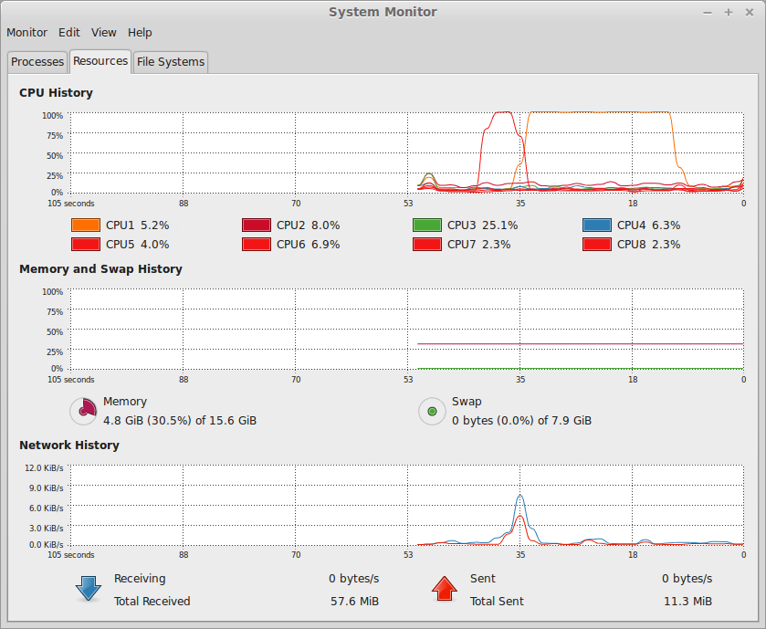

# Agile Performance Testing for Web Apps

'We deployed our web app once, finished the beta, everybody signed up, and we never had a problem.'  - No one ever

Unit testing gives us confidence to improve software features and add new ones.

Performance testing gives us confidence to offer those features reliably to known numbers of users.

Performance testing web apps was invented before the cloud.  Much of the information around performance testing is aimed at large enterprise projects with enterprise resources.  'Agile' means leaner, smaller, and iterative.  

This article looks at Agile Performance testing strategies.  We'll:

  - Build a small web app.  
  - Deploy it 
  - Performance test it with a variety of tools and techniques

We'll look at two broad strategies for running performance tests: Local, and Cloud.

But first, a little vocabulary and structure.

# Performance Testing Taxonomy

## Sub-species

There are some exotic animals out there, but the most common are:

  - **Load testing** measures how long to process a specific load. *How long does it take to process 10,000 requests?*

  - **Endurance/Soak testing** measures resource leaks (usually memory and disk) over sustained use.  *How often will the server "randomly" crash?*

  - **Stress testing** measures the upper performance limit before failure.  *Can it support 10,000 users simultaneously?*

  - **Spike testing** applies sudden increased load and measures results.  *Slashdot effect testing*

Asking these specific questions is part of asking the general question *How and when should I scale my web application?*  Luckily these different tests all have the same structure.


## Anatomy

Any successful performance test will have these parts:

  - **Server Under Test**: Software, hardware, and configuration. 

  - **Test Plan**

    - **Test Case(s)**: Series of requests and assertions, describing how the server would be used by one user.  These are more-or-less End-to-end Unit tests.  *login, put 4 things in cart, checkout, logout, done.*

    - **Load**: Description of how and when to run the test cases.  *1000 Users (aka Threads), running Test Case A, then B.  Looped 1000 times.*

  - **Testing Tool**:

    - Computers and software to run Test Cases, creating the Load, and summarizing the results.

  - **Test Report**:

    - Actionable data, easy to share, easy to compare, and preferrably without constant fiddling.

Test plan....  Snorrr....kgt!  Drool. Yeah, that'll happen.


## Most importantly, why!

Performance testing can be a huge --waste-- sink of time.  We're looking at strategies to iterate quickly, without building elaborate written test plans.  P.s. don't google 'Performance test plan'.

Performance testing should be done with a clear question or vision:   

  - *How can I make this use case faster?*

  - *I want each server to serve 1000 requests/second, without crashing or serving errors.*

  - *We have a marketing event.  The web applicaton needs to serve 70,000 requests/second.*

Once you have that, you'll have clear goals to iterate towards, and cut through lots of unnecessary effort.

# Server Under Test

Enough Preamble.  We need an API to test.  Because we'll be here awhile, let's look at some kittens.  

## Application API

These strategies and tools apply to any web app, on any hosting.

We're using [Node.js](https://nodejs.org/) hosted on [Heroku](https://devcenter.heroku.com/articles/getting-started-with-nodejs#introduction), because we had to pick something and Heroku Add-ons make it easy to blog about.

Our API has these routes:

    GET /tiny-kittens-in-your-memory/123         -> text/plain: filename 
    GET /big-kittens-in-your-memory/:id          -> image/jpeg: [kitten jpg data]
    GET /evil-kittens-sploding-your-memory/:id   -> locks 1 meg of memory for 1 seconds
    GET /evil-kittens-sploding-your-cpu/:id      -> 100% cpu for 1 seconds
    GET /evil-kittens-sploding-your-disk/:id     -> writes 1 meg to disk
    GET /evil-kittens-sploding-your-network/:id  -> text/plain: sends 512k of random data

:id is any string, used to cycle through the images, and memory leak 1mb/id.

Here's FIXME-github-link an Express 4.0 app implementing this API.  This server is neither secure or performant.  If you read the last few calls, you'll see it's small, cute, and shamelessly destructive.

## Server hardware and configuration

This article describes two servers under test, with strategies and things to be gained from each.

### Starting a Localhost Server To Test

If you'd like to play along, the code's on Github:

    # Download the code from github.
    git clone FIXME
    cd FIXME
    npm install
    node simple.js

If you're installing Node for the first time, [nvm(node version manager)](https://github.com/creationix/nvm) will simplify your life.

Open <a href="http://localhost:8000">http://localhost:8000</a> to test.

### Starting a Cloud Server To Test

If you don't want to install Node.js, you can still play along with a cloud server on Heroku.

    # Get the code.
    git clone FIXME
    cd FIXME
    # Create a Heroku account and log in
    heroku login
    # Create Heroku app and add git remote 'heroku'
    heroku create
    # Add load testing services
    heroku addons:add blazemeter:test
    heroku addons:add loaderio:basic
    heroku addons:add blitz:250
    # Add a remote logging service
    heroku addons:add papertrail:choklad
    # Deploy
    git push heroku master
    # Open app in browser
    heroku open
    # Open log in browser
    heroku addons:open papertrail

This should open the app and log in your browser.  It was created to be fun, innocent, and really destructive.

# Performance Testing on Localhost

What can we test on localhost?

**We can't do Stress Testing or Spike Testing**.  These are both 'destructive' testing trying to overwhelm the server.  Measuring the 'destruction' means measuring against the 'production configuration'.

Are those server code errors?  Or the configuration of your environment?  Was it the testing tool (JMeter) or Python (Gatling.io, locust.io)?  Your network driver?

Simply put, Stress and Spike testing require a set of clients that can overwhelm the server.  We can't do that all on the same machine.

**We can do Load and Endurance testing**.  These tests measure the affects of applying some constant load.  If we apply the same load to two different versions of the software, we can still get meaningful data by comparing results.

Simply put, performance testing on localhost is a dev task.

## A simple Load Test

[ApacheBench](http://httpd.apache.org/docs/2.2/programs/ab.html) is simple, light-weight, and scriptable.  You may already have `ab` installed:

```
sudo apt-get install apache2-utils
```

So let's test a change.  There are two versions of the server: `simple.js` with logging, and `simple2.js` without logging.

Start up the server in one console: `node simple.js`

Run the tests in another console.  -n means 10000 requests. -c means 10 threads concurrently.  -l means don't count variable length response as an error.

```
$ ab -l -n 10000 -c 10 http://localhost:8000/big-kittens-in-your-memory/simple
This is ApacheBench, Version 2.3 <$Revision: 1528965 $>
Copyright 1996 Adam Twiss, Zeus Technology Ltd, http://www.zeustech.net/
Licensed to The Apache Software Foundation, http://www.apache.org/

Benchmarking localhost (be patient)
Completed 1000 requests
Completed 2000 requests
Completed 3000 requests
Completed 4000 requests
Completed 5000 requests
Completed 6000 requests
Completed 7000 requests
Completed 8000 requests
Completed 9000 requests
Completed 10000 requests
Finished 10000 requests


Server Software:        
Server Hostname:        localhost
Server Port:            8000

Document Path:          /big-kittens-in-your-memory/simple
Document Length:        Variable

Concurrency Level:      10
Time taken for tests:   3.433 seconds
Complete requests:      10000
Failed requests:        0
Total transferred:      651885095 bytes
HTML transferred:       650055095 bytes
Requests per second:    2913.15 [#/sec] (mean)
Time per request:       3.433 [ms] (mean)
Time per request:       0.343 [ms] (mean, across all concurrent requests)
Transfer rate:          185453.16 [Kbytes/sec] received

Connection Times (ms)
              min  mean[+/-sd] median   max
Connect:        0    0   0.0      0       0
Processing:     1    3   1.6      3      51
Waiting:        1    3   1.6      3      50
Total:          2    3   1.6      3      51

Percentage of the requests served within a certain time (ms)
  50%      3
  66%      3
  75%      3
  80%      3
  90%      4
  95%      4
  98%      6
  99%      7
 100%     51 (longest request)
```

That's alot of copy/paste, but you can see some basic and useful information.  response time average, response time distribution, etc. 

Your OS has a resource utilization viewer (notice the the node.js process switching between cores):



Notice that Node.js is single threaded and serving 3k requests/second.  Nice!

Let's turn off logging and see what happens:

`ctrl-c` to kill the server, then `node simple2.js`.  Back to the test console and run it again.

The actual times don't predict production performance.  But comparing the two tells us about our implementations.

| Version          | 10k req   | req/s    | ms/req |
| ---------------- | --------- | -------- | ------ |
| A (with logging) | 3.433 sec | 2913.15  | 3.433  |
| B (w/o logging)  | 2.279 sec | 4387.75  | 2.279  |

So, logging requests to stdout is a 50% performance drag on our in-memory file server.  Noted!  

Hurray!  Our first 'Load Test'.  `ab` has plenty of options for making single requests, but it takes multiple requests to make a 'use case'.  For that, we'll need something stronger.

## An Endurance Test

So we've got two nasty resource leaks in our API:
 - Every new :id leaks 1 meg of memory
 - `evil-kittens-sploding-your-disk/id` also writes 1 meg to the disk.

Eventually our server will 'randomly' crash and we'd rather that happened during testing.  That test is an Endurance test.

### Reusing what we already have

If you're doing performance testing, you've probably already written end-to-end tests for your features.  It would be great to reuse those tests right?

`evil-kittens` was built using Node.js and Express, so naturally we'd write tests with Mocha and Supertest.  `npm test` will run the tests for us:

```
$ npm test

  evil-kittens API 
    ✓ gets a random tiny kitten - leak memory (292ms)
    ✓ gets an evil kitten - leak memory and disk (51ms)

  2 passing (348ms)
```

Ok, so our API is pretty stateless (except for the memory leak), but let's pretend these tests needed to be run in order.

Bash scripting is too much scaffolding.  But we could write a test and time it in our test runner.  The hack in `mocha` is to use `require-new`.  

`time mocha -R min etc/throughput.perf.js`, but still can do ~333 requests/second and is only running in one thread.

You might find these tools helpful for your platform.

> Scala: Check out [getling.io](http://gatling.io/) 
> Python:  Check out [locust.io](http://locust.io/) 

For something with more teeth, let's take a look at JMeter.

### Using JMeter

JMeter does:
 - End-to-end testing
 - Runs those tests in 'threads' to simulate multiple users

The first version of JMeter is from 1998.  17 years is a respectable run for any software (that's ~350 in software-years), and remembering that was vital to my happiness using it.

It offer's a 'recorder' http proxy that will "write your tests for you".  Tests can be recorded from browser interactions or the command line.


First, install [JMeter](http://jmeter.apache.org/index.html), and the [standard and extras](http://jmeter-plugins.org/wiki/Start/) plugins:

```
wget http://www.us.apache.org/dist//jmeter/binaries/apache-jmeter-2.13.tgz -O - | tar -xz
cd apache-jmeter-2.13
wget -qO- -O tmp.zip http://jmeter-plugins.org/downloads/file/JMeterPlugins-Standard-1.2.1.zip && unzip tmp.zip
wget -qO- -O tmp.zip http://jmeter-plugins.org/downloads/file/JMeterPlugins-Extras-1.2.1.zip && unzip tmp.zip
cd ..
```

(Yes or No to replacing LICENSE and README.  Windows users might find this[guide](http://www.guru99.com/guide-to-install-jmeter.html) useful)

Start JMeter:

```
./apache-jmeter-2.13/bin/jmeter
```

To record a test plan, 

  - "File -> Templates -> Select Template: 'Recording' -> Create".  
  - Open 'Workbench', 
  - Select 'HTTP(S) Test Script Recorder'
  - Scroll down and click 'Start' at the bottom, click 'Ok'.

Port 8888 is now a proxy server. Note that this isn't a 'transparent proxy', so HTTPS requests require special shenanigans (that was the 'ok' dialog).  Clients must do some extra work crafting requests for them to be proxied (and therefor recorded by JMeter).

You can 'record' requests by [configuring your browser](http://www.wikihow.com/Change-Proxy-Settings), or from the command line via an environment variable: 

```
http_proxy="http://localhost:8888/" wget http://localhost:8000/
```

Let's run our Mocha tests through it:

```
http_proxy="http://localhost:8888/" npm test
```

> Node.js:  Unfortunately Supertest isn't the answer.  It doesn't [respect process.env.http_proxy](https://github.com/visionmedia/supertest/issues/214).  I re-wrote the kitten tests using a patched version of 'Hippie', which uses the newest 'request', which uses process.env.http_proxy.
> If this seems like alot of work and caveats, it is.  It would be better to record these requests on the server instead of through a proxy.

Great, now we're recorded or written a pile of HTTP requests in our JMeter test.  JMeter lets us replay those requests rapidly by creating 'threads' (aka users/agents).  These threads run simultaneously, and can loop over the requests.

JMeter was designed as it's own E2E testing tool, so can do assertions and other complexities.  Need cookies?  'Right-click -> Add -> Config Element'

### Localhost JMeter Endurance Test 

  - Open `endurance.jmx` to see our endurance test plan.  
    - 'User Defined Variables' sets server, port, 100 threads, and 100 loops.
    - Requests have randomized id's to expose the leaks.
    - All requests should respond 200.
  - Click the green triangle to run the tests.
  - Click around on the reports


For raw throughput on our simple in-memory request, JMeter was on par with `ab`.  See `etc/throughput.jmx`.

### Server Hardware and Configuration

On my laptop, I leaked 1 meg/request on 10,000 requests with 0 failures.  It took my laptop right up to it's 16 gig limit.  

| System              | CPU's    | Memory | Disk        |
| ------------------- | -------- | ------ | ----------- |
| My System76 laptop  |  8 cores | 16 gig | 256 gig SSD |
| Heroku Free Node    |  1 core  | .5 gig | .2 gig      | 

Our free Heroku instance is 8-32-1000x more fragile that my laptop.  

The best way to do this is with a Virtual Machine, for example [Vagrant](https://docs.vagrantup.com/v2/why-vagrant/index.html)

> Heroku:  Note that `heroku local` doesn't set memory limits.  You might try [Vagrant-Heroku](https://github.com/ejholmes/vagrant-heroku#building-from-scratch).

## Localhost Testing Takeaways

1) Testing on localhost allows interative performance improvements.  We can do Load and Endurance testing, and compare the results.  We can't do Stress or Spike testing, because those are about hardware and configuration.

2) Simple is better.  `ab` can generate test loads for endurance and load testing.  It doesn't get the Google SEO love, but it's a good place to start.

3) Use what you already have.  If you can, re-use existing end-to-end tests for Load and Endurance testing.

3) We've already written E2E tests, but converting them to a Test Load is non-trivial.

4) JMeter is a powerful tool for writing E2E load tests.  **In my experience, JMeter is a useful tool, but takes a large investment of time.** 

5) Considering the learning curve for creating, maintaining, and sharing tests, `ab` is probably more productive.

6) For an enterprise building a test lab, JMeter would be an essential tool.  But we're Agile, so let's rent one from the cloud.

Why not build a test lab? you ask.  Pull up a chair, and let me tell you a story...

> Back in the caveman days of the 1990's, we had to program computers with rocks, fire, and C++.  There was no wifi (literally not invented), and 'web hosting' meant a strip-mall data center with a locked 'cage' containing an ethernet cable and clean power.  You bought your own server, which arrived in a cow-colored box, then drove it to the 'cage' to install yourself.  It was a fun day-trip, except when dinosaurs attacked.  
> Ops (devops not invented) bought two sets of hardware, one they locked in the 'cage', and one for the 'test lab'.  The test lab was on the local network so you could do distributed load testing from your co-workers desktops.  A desktop is...

Why the old-timey grandpa stories?  Because in the old days, ops meant spare cables and screwdrivers.  Now, Agile teams spin up servers at data centers around the globe, while sipping iced coffee in Thai cafes.

It's important to remember many of these tools were built in the caveman era - before Agile.  Their heavy-weight design and UI may lead Agile devops teams in the wrong direction.

JMeter/etc are still useful for enterprises with 'test labs', but I'm going to guess most 'Agile' teams would rather build features than 'test labs'.  Luckily Cloud Computing let's you quickly rent one.

# Performance Testing in the Cloud

Because our little Heroku server is in a production-like configuration, we can now do Stress and Spike Testing.

Let's take another look at our server

```
git push heroku master
heroku restart
heroku open
heroku addons:open papertrail
```


## From Localhost

As a curiosity, we can test our Heroku instance from localhost.  If you've been following along with our `tiny/big-kittens-in-memory` examples, we could try them on Heroku to see throughput.  From Asia, I'm able to get 4.5/s on big-kittens, and 24.6/s on tiny kittens.  That's a *huge* difference from localhost servers (4k/s).

We can also run our Endurance test from localhost.  Update `endurance.jmx`'s 'User Defined Variables':

    - server -> <your heroku app domain>
    - port -> 80

Click run, and JMeter will start at ~ 20 requests/second.  You'll see literally thousands of log entries, but these are interesting:

```
May 04 02:18:35 protected-reaches-5163 heroku/web.1:  Process running mem=2649M(517.4%) 
May 04 02:18:35 protected-reaches-5163 heroku/router:  at=info method=GET path="/tiny-kittens-in-your-memory/2957382171" host=protected-reaches-5163.herokuapp.com request_id=ad3ffdf9-b5fa-4ca2-8c2a-1461909fc4e7 fwd="146.88.41.79" dyno=web.1 connect=0ms service=4041ms status=200 bytes=204 
May 04 02:18:35 protected-reaches-5163 heroku/web.1:  Error R15 (Memory quota vastly exceeded) 
May 04 02:18:35 protected-reaches-5163 heroku/web.1:  Stopping process with SIGKILL 
```

So finally our Endurance test found the memory leak.  Heroku killed our runaway process at 2.6 gig.  You'll see test errors as well in Jmeter.  (A smarter test would check process memory at shutdown)

Let's open our [Heroku dashboard](https://dashboard.heroku.com/apps) and try some Cloud load testing tools.

`heroku restart` will reboot your instance.

## Blazemeter

Blazemeter, as you could tell from the name, is excited to run your JMeter tests in the cloud.  They'll also run your Selenium WebDriver scripts.

We can upload `endurance.jmx` to Blazemeter, but each change is ~5 mins to upload and retry.  That's not very exciting if you're not already heavily invested in JMeter.

Let's take a look at their more light-weight offering.  Blazemeter offers a "Http Urls List Test" similar to our `ab` test.  Some screenshots below show the test and some results pages.  The freemium offering was making ~9 requests/second on our `tiny-kittens-in-your-memory` url.  Clearly, Blazemeter isn't overwhelming our server.

![articles/screenshots/Blazemeter*.png]

Blazemeter is only offering a free version through Heroku.  They offer monthly plans for $249+/mo. 

## Blitz

Blitz is a bit more suited to running Stress and Spike testing.  Their freemium option offers a 60 second 'rush' that looks suitable for doing Stress and Spike testing.  The service seems to ramp up users slowly, so it never got into the thousands, but 242 requests/seconds is pretty informative.  The UI is easy to understand, and in about 2 minutes you'll have a result.  This is starting to feel Agile.

![articles/screenshots/Blitz*]

Unfortunately, their pricing is $799+/month, so we didn't test that.

There are lots of other load testing services.

## Loader.io

While a bit annoying to verify the domain, it just took a minute to add the route.  Loader.io is the most reasonable priced at $99/mo, with some generous offerings re: number of clients.  We were able to do 10k/min, or 166 requests/second without any ramp-up time.  While far from a kitten spike test, their $99/mo offer is for 10x that.

Overall, Blitz and Loader.io felt the most Agile in terms of firing up a server and running some tests, while Blazemeter is a great offering for distributing load from JMeter and Selenium/Webdriver tests.

![articles/screenshots/Loader.io*]


# The End already.

So, that was quite a journey!  We looked at:

 - 4 kinds of tests:  Load, Endurance, Stress, and Spike.  
 - 2 kinds of testing: localhost (for dev) and cloud (for devops)
 - localhost testing tools tools: `ab`, JMeter, Mocha
 - Cloud testing offerings: Blazemeter, Blitz, and Loader.io
 - Some adorable kittens

There's alot more we could cover, but there's enough here for an iteration of performance testing, and that's what staying Agile is all about.
